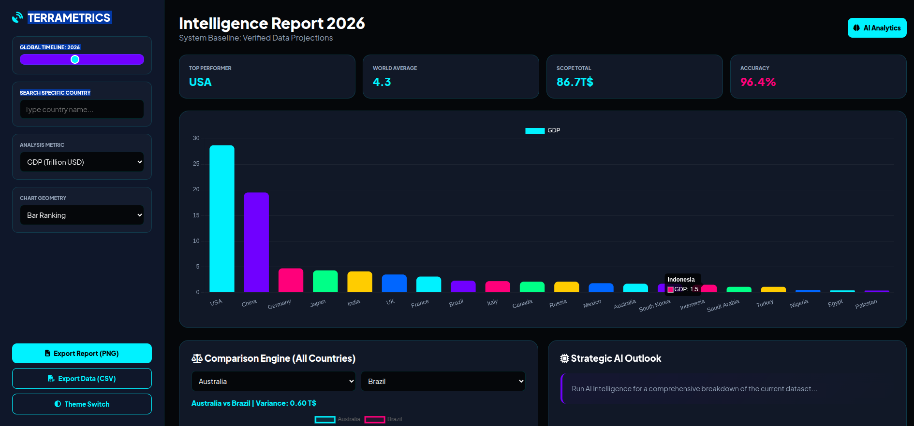

# 🌍 **TerraMetrics Nexus v5.1** — Global Intelligence Dashboard

<p align="center">
  
</p>

<p align="center">
  
</p>

<p align="center">
  
  
  
  
  
  
</p>

<p align="center">
  <b>Interactive real‑time simulation of global metrics • Compare nations • AI‑driven insights • Dark/light theme</b>
</p>

<p align="center">
  <i>“See the future of world data – GDP, CO₂, population, digital adoption and more.”</i>
</p>

---

## 🎯 **Project Overview**

<div align="center" style="
    background: linear-gradient(135deg, rgba(127,63,191,0.1), rgba(255,107,107,0.1));
    padding: 30px;
    border-radius: 20px;
    margin: 20px 0;
    border: 2px solid rgba(127,63,191,0.4);">

**TerraMetrics Nexus** is a powerful, client‑side data visualization dashboard that lets you explore **20+ countries** across **6 key metrics** from **2000 to 2060**. It combines futuristic design with real‑time projections based on compound annual growth rates (CAGR). Whether you're an economist, student, or data enthusiast, this tool gives you an interactive lens into global trends.

> 🧠 **Live intelligence at your fingertips** – adjust the timeline, filter by country, switch chart types, and even compare two nations side‑by‑side with a radar chart.

</div>

---

## ✨ **Key Features**

<div align="center" style="display: grid; grid-template-columns: repeat(auto-fit, minmax(300px, 1fr)); gap: 20px; margin: 20px 0;">

<!-- Feature 1 -->
<div style="
    background: linear-gradient(135deg, rgba(26,26,46,0.8), rgba(22,33,62,0.9));
    padding: 25px;
    border-radius: 15px;
    border: 2px solid #7F3FBF;
    transition: all 0.3s ease;"
    onmouseover="this.style.transform='translateY(-10px)'; this.style.boxShadow='0 15px 30px rgba(127,63,191,0.4)'"
    onmouseout="this.style.transform='translateY(0)'; this.style.boxShadow='none'">
  <div style="display: flex; align-items: center; gap: 15px; margin-bottom: 15px;">
    <div style="background: #7F3FBF; width: 50px; height: 50px; border-radius: 10px; display: flex; align-items: center; justify-content: center; font-size: 1.8em;">🌐</div>
    <h3 style="margin: 0; color: #fff;">Global Database</h3>
  </div>
  <p style="color: #e0e0e0; line-height: 1.6;">20 nations with realistic CAGR projections for GDP, Population, CO₂, Life Expectancy, Digital Adoption & Military Spending.</p>
</div>

<!-- Feature 2 -->
<div style="
    background: linear-gradient(135deg, rgba(26,26,46,0.8), rgba(22,33,62,0.9));
    padding: 25px;
    border-radius: 15px;
    border: 2px solid #FF6B6B;
    transition: all 0.3s ease;"
    onmouseover="this.style.transform='translateY(-10px)'; this.style.boxShadow='0 15px 30px rgba(255,107,107,0.4)'"
    onmouseout="this.style.transform='translateY(0)'; this.style.boxShadow='none'">
  <div style="display: flex; align-items: center; gap: 15px; margin-bottom: 15px;">
    <div style="background: #FF6B6B; width: 50px; height: 50px; border-radius: 10px; display: flex; align-items: center; justify-content: center; font-size: 1.8em;">📈</div>
    <h3 style="margin: 0; color: #fff;">6 Core Metrics</h3>
  </div>
  <p style="color: #e0e0e0; line-height: 1.6;">Choose from GDP, Population, CO₂ Emissions, Life Expectancy, Digital Adoption, and Military Spending.</p>
</div>

<!-- Feature 3 -->
<div style="
    background: linear-gradient(135deg, rgba(26,26,46,0.8), rgba(22,33,62,0.9));
    padding: 25px;
    border-radius: 15px;
    border: 2px solid #00C851;
    transition: all 0.3s ease;"
    onmouseover="this.style.transform='translateY(-10px)'; this.style.boxShadow='0 15px 30px rgba(0,200,81,0.4)'"
    onmouseout="this.style.transform='translateY(0)'; this.style.boxShadow='none'">
  <div style="display: flex; align-items: center; gap: 15px; margin-bottom: 15px;">
    <div style="background: #00C851; width: 50px; height: 50px; border-radius: 10px; display: flex; align-items: center; justify-content: center; font-size: 1.8em;">🕰️</div>
    <h3 style="margin: 0; color: #fff;">Timeline Slider</h3>
  </div>
  <p style="color: #e0e0e0; line-height: 1.6;">Drag from 2000 to 2060 – watch values evolve with smooth exponential projections.</p>
</div>

<!-- Feature 4 -->
<div style="
    background: linear-gradient(135deg, rgba(26,26,46,0.8), rgba(22,33,62,0.9));
    padding: 25px;
    border-radius: 15px;
    border: 2px solid #4285F4;
    transition: all 0.3s ease;"
    onmouseover="this.style.transform='translateY(-10px)'; this.style.boxShadow='0 15px 30px rgba(66,133,244,0.4)'"
    onmouseout="this.style.transform='translateY(0)'; this.style.boxShadow='none'">
  <div style="display: flex; align-items: center; gap: 15px; margin-bottom: 15px;">
    <div style="background: #4285F4; width: 50px; height: 50px; border-radius: 10px; display: flex; align-items: center; justify-content: center; font-size: 1.8em;">🔍</div>
    <h3 style="margin: 0; color: #fff;">Country Search</h3>
  </div>
  <p style="color: #e0e0e0; line-height: 1.6;">Filter the main chart dynamically by typing a country name.</p>
</div>

<!-- Feature 5 -->
<div style="
    background: linear-gradient(135deg, rgba(26,26,46,0.8), rgba(22,33,62,0.9));
    padding: 25px;
    border-radius: 15px;
    border: 2px solid #7F3FBF;
    transition: all 0.3s ease;"
    onmouseover="this.style.transform='translateY(-10px)'; this.style.boxShadow='0 15px 30px rgba(127,63,191,0.4)'"
    onmouseout="this.style.transform='translateY(0)'; this.style.boxShadow='none'">
  <div style="display: flex; align-items: center; gap: 15px; margin-bottom: 15px;">
    <div style="background: #7F3FBF; width: 50px; height: 50px; border-radius: 10px; display: flex; align-items: center; justify-content: center; font-size: 1.8em;">📊</div>
    <h3 style="margin: 0; color: #fff;">Multiple Chart Types</h3>
  </div>
  <p style="color: #e0e0e0; line-height: 1.6;">Bar, Line, Doughnut – switch perspectives for different analytical views.</p>
</div>

<!-- Feature 6 -->
<div style="
    background: linear-gradient(135deg, rgba(26,26,46,0.8), rgba(22,33,62,0.9));
    padding: 25px;
    border-radius: 15px;
    border: 2px solid #FF6B6B;
    transition: all 0.3s ease;"
    onmouseover="this.style.transform='translateY(-10px)'; this.style.boxShadow='0 15px 30px rgba(255,107,107,0.4)'"
    onmouseout="this.style.transform='translateY(0)'; this.style.boxShadow='none'">
  <div style="display: flex; align-items: center; gap: 15px; margin-bottom: 15px;">
    <div style="background: #FF6B6B; width: 50px; height: 50px; border-radius: 10px; display: flex; align-items: center; justify-content: center; font-size: 1.8em;">🤖</div>
    <h3 style="margin: 0; color: #fff;">AI Analytics</h3>
  </div>
  <p style="color: #e0e0e0; line-height: 1.6;">One‑click narrative summary of the current dataset – get insights instantly.</p>
</div>

<!-- Feature 7 -->
<div style="
    background: linear-gradient(135deg, rgba(26,26,46,0.8), rgba(22,33,62,0.9));
    padding: 25px;
    border-radius: 15px;
    border: 2px solid #00C851;
    transition: all 0.3s ease;"
    onmouseover="this.style.transform='translateY(-10px)'; this.style.boxShadow='0 15px 30px rgba(0,200,81,0.4)'"
    onmouseout="this.style.transform='translateY(0)'; this.style.boxShadow='none'">
  <div style="display: flex; align-items: center; gap: 15px; margin-bottom: 15px;">
    <div style="background: #00C851; width: 50px; height: 50px; border-radius: 10px; display: flex; align-items: center; justify-content: center; font-size: 1.8em;">⚖️</div>
    <h3 style="margin: 0; color: #fff;">Comparison Engine</h3>
  </div>
  <p style="color: #e0e0e0; line-height: 1.6;">Compare any two countries with a radar chart showing all six metrics.</p>
</div>

<!-- Feature 8 -->
<div style="
    background: linear-gradient(135deg, rgba(26,26,46,0.8), rgba(22,33,62,0.9));
    padding: 25px;
    border-radius: 15px;
    border: 2px solid #4285F4;
    transition: all 0.3s ease;"
    onmouseover="this.style.transform='translateY(-10px)'; this.style.boxShadow='0 15px 30px rgba(66,133,244,0.4)'"
    onmouseout="this.style.transform='translateY(0)'; this.style.boxShadow='none'">
  <div style="display: flex; align-items: center; gap: 15px; margin-bottom: 15px;">
    <div style="background: #4285F4; width: 50px; height: 50px; border-radius: 10px; display: flex; align-items: center; justify-content: center; font-size: 1.8em;">🌓</div>
    <h3 style="margin: 0; color: #fff;">Theme Switcher</h3>
  </div>
  <p style="color: #e0e0e0; line-height: 1.6;">Sleek dark / light mode with a single click.</p>
</div>

<!-- Feature 9 -->
<div style="
    background: linear-gradient(135deg, rgba(26,26,46,0.8), rgba(22,33,62,0.9));
    padding: 25px;
    border-radius: 15px;
    border: 2px solid #7F3FBF;
    transition: all 0.3s ease;"
    onmouseover="this.style.transform='translateY(-10px)'; this.style.boxShadow='0 15px 30px rgba(127,63,191,0.4)'"
    onmouseout="this.style.transform='translateY(0)'; this.style.boxShadow='none'">
  <div style="display: flex; align-items: center; gap: 15px; margin-bottom: 15px;">
    <div style="background: #7F3FBF; width: 50px; height: 50px; border-radius: 10px; display: flex; align-items: center; justify-content: center; font-size: 1.8em;">📁</div>
    <h3 style="margin: 0; color: #fff;">Export Reports</h3>
  </div>
  <p style="color: #e0e0e0; line-height: 1.6;">PNG snapshot of main chart + CSV raw data for further analysis.</p>
</div>

</div>

---

## 📸 **Dashboard Preview**

<div align="center" style="
    background: linear-gradient(135deg, rgba(127,63,191,0.2), rgba(255,107,107,0.2));
    padding: 30px;
    border-radius: 20px;
    margin: 20px 0;
    border: 2px solid #FFD700;">

### ✨ **Live Demo**

> 🌐 **Try it now!** – Simply open `index.html` in your browser (no build required).

<p align="center">
  
</p>

<p align="center">
  <i>(Add your own screenshot here – replace placeholder with actual image)</i>
</p>

</div>

---

## 🛠️ **Tech Stack**

<div align="center">

### 🟣 **Core Libraries**


</div>

---

## 🚀 **Getting Started**

<div align="center" style="
    background: linear-gradient(135deg, rgba(26,26,46,0.95), rgba(22,33,62,0.95));
    padding: 35px;
    border-radius: 25px;
    margin: 25px 0;
    border: 2px solid rgba(255,215,0,0.3);
    box-shadow: 0 15px 35px rgba(255,215,0,0.2);">

### 📦 **Installation**

1. **Clone the repository**
   ```bash
   git clone https://github.com/yourusername/terrametrics-nexus.git
   cd terrametrics-nexus
   ```

2. **Open the dashboard**
   - Simply open `index.html` in your favourite modern browser.
   - No build step, no dependencies to install – it just works!

> 💡 **Tip:** Use Live Server in VS Code for the best development experience.

### 🎮 **How to Use**

| Control | Action |
|--------|--------|
| **Timeline slider** | Drag to change the year (2000–2060) – all charts and stats update instantly. |
| **Metric dropdown** | Choose between GDP, Population, CO₂, Life Expectancy, Digital Adoption, or Military Spending. |
| **Country search** | Type part of a country name to filter the main chart. |
| **Chart type** | Switch between bar ranking, growth curve (line), or distribution (doughnut). |
| **Compare two countries** | Use the two dropdowns in the Comparison Engine card. A radar chart shows relative strengths across all metrics. |
| **AI Analytics** | Click the button to get a textual insight based on current data. |
| **Export PNG** | Saves the main chart as an image with a dark/light background. |
| **Export CSV** | Downloads all countries and the selected metric as a CSV file. |
| **Theme toggle** | Switch between dark (default) and light themes. |

</div>

---

## 📈 **Data & Projections**

<div align="center" style="
    background: linear-gradient(135deg, rgba(127,63,191,0.1), rgba(66,133,244,0.1));
    padding: 30px;
    border-radius: 20px;
    margin: 20px 0;
    border: 2px solid #4285F4;">

All base values are approximations for the year **2026** (the default slider position). Each country has a `cagr` object that defines the compound annual growth rate for each metric. The formula used:

```
value(year) = baseValue * (cagr ^ (year - 2026))
```

This gives a smooth, exponential projection. Feel free to tweak the rates in the `BASE_DB` array inside the `<script>` tag to match your own research or scenarios.

**Example entry:**
```javascript
{ n: "India", gdp: 4.1, pop: 1.45, co2: 2700, life: 70.4, tech: 65, military: 81,
  cagr: { gdp: 1.065, pop: 1.01, co2: 1.03, tech: 1.05 } }
```

</div>

---

## 👨‍💻 **Author**

<div align="center" style="
    background: linear-gradient(135deg, rgba(127,63,191,0.2), rgba(255,107,107,0.2));
    padding: 40px;
    border-radius: 25px;
    margin: 20px 0;
    border: 3px solid #7F3FBF;
    box-shadow: 0 15px 35px rgba(127,63,191,0.4);">

<h2 style="color: #FFD700; margin-bottom: 20px;">Arif Ali</h2>

<p style="color: #fff; font-size: 1.2em;">Software Engineer • Open Source Contributor • Data Visualization Enthusiast</p>

<div style="display: flex; justify-content: center; gap: 20px; flex-wrap: wrap; margin: 25px 0;">

<a href="https://portfolio-lovat-five-67.vercel.app" target="_blank">
  
</a>
<a href="https://linkedin.com/in/arif-ali-23a38032a" target="_blank">
  
</a>
<a href="https://github.com/ArifAli8866" target="_blank">
  
</a>
<a href="mailto:2arif2143055@gmail.com" target="_blank">
  
</a>

</div>

<p style="color: #00FF88;">📍 Islamabad, Pakistan • Open to Remote Opportunities</p>

</div>

---

## 🤝 **Contributing**

Contributions, issues, and feature requests are welcome!  
Feel free to check the [issues page](https://github.com/yourusername/terrametrics-nexus/issues).

- **Add more countries** – extend `BASE_DB`
- **Improve UI/UX** – refine the layout or animations
- **Enhance AI logic** – make the insight generation smarter
- **Add new metrics** – like education, energy consumption, etc.

Please open a pull request and describe your changes.

---

## 📄 **License**

Distributed under the **MIT License**. See `LICENSE` for more information.

---

## 🌟 **Footer**

<div align="center">

<!-- Waving Footer -->


<br><br>

<!-- Final Quote -->
<div style="
    background: linear-gradient(90deg, 
        #7F3FBF 0%, 
        #412991 25%, 
        #FF6B6B 50%, 
        #00C851 75%, 
        #4285F4 100%);
    padding: 25px;
    border-radius: 15px;
    margin: 20px 0;
    box-shadow: 0 10px 30px rgba(0,0,0,0.3);">
  <p style="
      font-size: 1.3em;
      color: white;
      font-weight: bold;
      text-shadow: 2px 2px 4px rgba(0,0,0,0.5);
      line-height: 1.5;">
    ✨ "Data is the new oil – visualize it to refine it into intelligence." ✨<br>
    <span style="font-size: 0.8em; opacity: 0.9;">- Arif Ali</span>
  </p>
</div>

<!-- Colorful Badges -->
<p align="center">
  
  
  
  
</p>

<!-- Visitor Counter -->
<p align="center">
  
</p>

<!-- Last Updated -->
<p align="center" style="color: #FFD700; font-size: 0.9em;">
  ⏰ Last Updated: February 2026 | 📱 Fully Responsive Design | 🎨 Custom Styled
</p>

</div>

---

<p align="center">
  <i>If you like this project, please ⭐ it and share it with others!</i>
</p>
